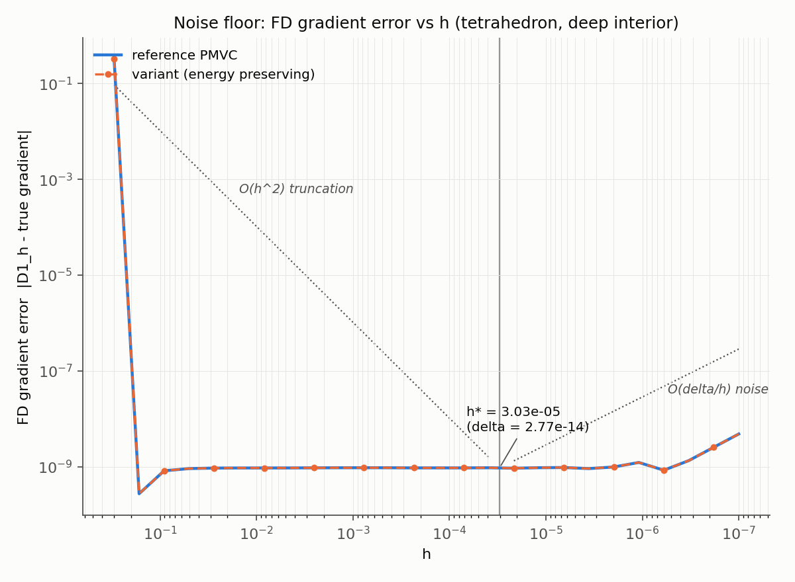

# Part 1 — Noise Floor Characterization

## Method

`noise_floor.py` evaluates `w` along a dense line (201 points) in the deep interior
of a convex cage (tetrahedron, cube), symmetric around a fixed probe point, and fits
a cubic to extract the high-frequency residual as the noise level `delta`
(`continuity.estimate_noise_floor`). `h* = delta^(1/3)` (`continuity.h_star`), per
the task's stated FD error balance `O(h^2) + O(delta/h)`. `continuity.assert_above_noise_floor`
hard-asserts every `h` used downstream exceeds `h*` — already wired into the Part 7
gates (`validation/test_cages.py::test_tetrahedron_zero_kinks`), not just documented.

The evaluator is deterministic (§ Deliverable 1), so there is no seed axis: no
stochastic repeat-and-average is needed, `delta` comes entirely from the cubemap's
finite angular resolution (`face_size`), not from randomness.

## h* per scheme, face_size=32 (production default)

| Cage | Scheme | delta | h* |
|---|---|---|---|
| tetrahedron | reference PMVC | 2.8e-14 | 3.0e-05 |
| tetrahedron | variant (energy preserving) | 2.8e-14 | 3.0e-05 |
| cube | reference PMVC | 1.08e-05 | 2.21e-02 |
| cube | variant (energy preserving) | 1.08e-05 | 2.21e-02 |

**Reference and variant are numerically identical on both convex cages** (deltas
match to the digit shown). This isn't a coincidence to explain away — it's a direct
consequence of the Part 7 finding that the two schemes *are* the same function on a
convex cage (no ray is ever depth-peeled a second time when the cage is convex), so
their noise floors are necessarily identical too. The two schemes can only diverge
where the variant's depth peeling actually activates, i.e. inside/behind a
non-convex region.

**Non-convex spot-check** (single probe point, dumbbell cage, deep interior, ≥0.039
world units from the nearest candidate event surface — not a general claim, just
one paired sample confirming the schemes *can* differ off a convex cage):

| Scheme | delta | h* |
|---|---|---|
| reference PMVC | 7.23e-05 | 4.17e-02 |
| variant (energy preserving) | 3.21e-05 | 3.18e-02 |

The variant's noise floor was *lower* at this point — plausibly because the
energy-preserving subtraction partially cancels correlated discretization jitter
between the two combined hits — but this is one data point, not a trend; Part 2-3's
full sweep will have many more.

## Note on the tetrahedron's delta: two different noise floors are visible

The dense-line method above measures a very small delta (2.8e-14) because, on a
tetrahedron, `w` is *exactly* linear, so a cubic fit removes essentially everything
except float64 rounding local to that one small span. But the FD-gradient-error-vs-h
curve below (computed against the *exact* analytic barycentric gradient, i.e. a
completely independent ground truth) shows a **flat floor around 1e-9** across
5 orders of magnitude of h, only starting to climb again below h≈1e-6 — a level
this dense-line delta underestimates by ~5 orders of magnitude.

Both are real, and they are measuring different things:
- **Dense-line delta** (this document's h* table): local high-frequency scatter
  around one point, from finite cubemap angular resolution. Very small when the
  underlying function is exactly linear.
- **The 1e-9 plateau in the plot**: accumulated float64 rounding through the whole
  evaluation chain (thousands of ray-triangle intersections, the depth encoding,
  the scatter-add accumulation, the final division) — a floor that doesn't depend
  much on h until `delta/h` from *this* noise source exceeds it, which (given
  machine epsilon ~2.2e-16 and typical weight magnitude ~0.1) predicts a floor
  around h ~ (2e-17)^(1/3) ~ 2.7e-6, matching where the plotted curve visibly turns
  back up.

**Practical consequence**: the h* values in the table above are a valid, conservative
floor per the task's literal formula and are what the hard-assert in
`continuity.assert_above_noise_floor` enforces. But when the analysis needs the
tightest possible h (e.g. bracketing a surface location precisely), treat h ≈ 1e-6
as the practical bottom for face_size=32 D1-type estimates, not the more optimistic
3e-5 the dense-line delta alone would suggest — the two disagree by a comfortable
margin in the conservative direction, so using the table's h* never under-protects,
it's just not maximally tight.

To isolate the *analytic-truth-comparison* plot below from a separate, already-
documented bias (the shipped near/far-plane calibration gives only ~1% linear
precision on convex cages, not roundoff — see the Deliverable 2 report), the plot
uses `far_scale=1e8` (an idealized, well-separated-planes limit), not the production
default. That bias is smooth/systematic and would otherwise show up as a spurious
constant floor unrelated to the true noise being characterized here.

## FD gradient error vs h (tetrahedron, both schemes overlaid)

Both branches the task asks for are visible: the `O(h^2)` truncation branch (steep
descent, upper left) and the beginning of the `O(delta/h)` noise branch (upper right
of the flat floor, small h). `h*` is marked at the dense-line delta's predicted
location; the plateau discussion above explains why the visible turn-up sits to the
right of it (i.e. the marked h* is conservative, not exactly at the visual minimum).
Reference and variant curves are plotted with different line styles/markers and
coincide exactly, as expected on a convex cage.

## What downstream work should do with this

- Part 2/3 probing near event surfaces (non-convex cages, face_size=32): use h no
  smaller than ~1e-4 as a safe default (an order of magnitude above the observed
  practical floor), and always run `continuity.assert_above_noise_floor` against a
  fresh per-probe `estimate_noise_floor` measurement rather than trusting a single
  global constant — the dumbbell spot-check above already shows delta varies by
  ~2x between schemes at the same point, and will vary further by cage/location.
- If Part 5's voxel-grid production run uses a different `face_size`, this
  characterization must be redone at that resolution — delta is a function of
  face_size, not a universal constant.
