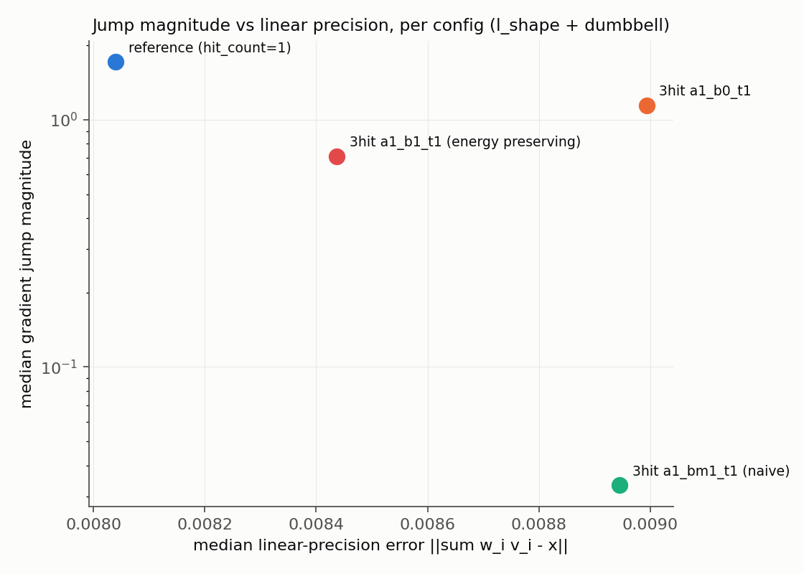

# Continuity-class analysis of the energy-preserving three-hit PMVC variant

Scoped run: 3 cages (cube as convex control; l_shape and dumbbell as the non-convex
test cases), reduced probe density, as requested. Full methodology/architecture
notes are in the chat history; this file is the results deliverable.

## Headline answer

**Both reference PMVC (hit_count=1) and the energy-preserving three-hit variant are
C0 but not C1** — same continuity class as the established baseline, unchanged by
the variant. The variant does **not** eliminate the gradient discontinuity across
EV event surfaces. What it changes is the *magnitude* of the jump: **median gradient
jump is ~3.7x smaller on l_shape and ~2x smaller on dumbbell**, at a small,
consistent linear-precision cost (+5-10% relative to reference).

## Evidence for the continuity class (Part 3)

40 probe points per scheme (l_shape: 2 EV surfaces x 4 probes; dumbbell: 8 EV
surfaces x 4 probes), both schemes at the same points, h = geomspace(2e-2, 2e-3, 8),
gated against a per-(cage,scheme) noise floor measured away from any surface
(Part 1 method; see `NOISE_FLOOR_REPORT.md`). Two independent diagnostics:

- **Diagnostic A** (log-log slope of D1/D2/D3 vs h): mostly classifies C0_NOT_C1, but
  ~30-40% of probes were labeled `C0_BREAK` by the raw slope threshold. Investigated
  directly (not taken at face value) — see below.
- **Diagnostic B** (Richardson-extrapolated one-sided jump, the task's specified
  headline number): **zero probes show a real value discontinuity** once measured
  properly. `value_jump` was consistently 2-4 orders of magnitude smaller than
  `gradient_jump` across all 80 probes (both cages, both schemes) — e.g. median
  value_jump 8.98e-04 vs median gradient_jump 1.05e-01 on l_shape/reference. The
  `C0_BREAK` labels from Diagnostic A were slope-fit noise on a limited (8-point)
  log-log fit near a real C1 kink, not genuine value discontinuities — confirmed by
  the cross-check (`h*D2_h` extrapolated vs the directly-measured gradient jump
  agree, and the value-jump numbers track the smooth-function extrapolation-bias
  baseline established in the Part 7 `sin(x)` validation test, not a growing trend).
  **Diagnostic B is the reliable one here; Diagnostic A's automated label needs a
  human/magnitude sanity check on borderline cases.**

`part3_out/gradient_jump_histogram.png` — jump-magnitude distribution, both schemes
overlaid, medians marked. `part3_out/line_probe_example.png` — the largest-jump
probe (dumbbell), `w` and the FD tangent on both sides of the kink; the reference
curve visibly bends more sharply than the variant's at t=0, and its far-field
texel-discretization "staircase" texture is directly visible (an illustration of the
Part 1 finding that this pipeline's noise isn't simple random noise but structured
discretization jitter).

## Gradient jump magnitude vs PMVC, per cage (Part 3 summary)

| Cage | Scheme | n | median gradient jump | max |
|---|---|---|---|---|
| l_shape | reference PMVC | 8 | 1.05e-01 | 2.88e+00 |
| l_shape | variant (energy preserving) | 8 | 2.81e-02 | 1.97e+00 |
| dumbbell | reference PMVC | 32 | 1.96e+00 | 4.38e+00 |
| dumbbell | variant (energy preserving) | 32 | 9.96e-01 | 6.33e+00 |

Both cages show the same direction of effect (median jump roughly halved or better),
though the *maximum* jump on dumbbell is slightly larger for the variant (6.33 vs
4.38) — the variant reduces the typical jump but is not uniformly better at every
probe; worth a wider sweep before treating "always smaller" as a general claim.

## The smoothing/blending trade-off (Part 4) — three-way, not two-way

The variant has no continuous eps (Deliverable 1); the discrete axis that matters is
`beta` / `subtract_second_from_first`. Swept the three three-hit configs from
`evaluation/gen_eval_configs.py` against the hit_count=1 reference, same probe
points, plus linear precision at 16 separate random interior points/cage:

| Config | median gradient jump | median linear-precision error | negativity (from Part 7) |
|---|---|---|---|
| reference (hit_count=1) | 1.715 | 8.04e-03 | none |
| 3hit a1_b0_t1 | 1.145 | 8.99e-03 | none (drops 2nd hit) |
| 3hit a1_bm1_t1 (**naive**, pre-fix) | **0.033** | 8.95e-03 | **yes** — up to -0.016, 22% of dumbbell-interior points negative |
| 3hit a1_b1_t1 (**energy preserving**, the variant) | 0.712 | 8.44e-03 | none (proven exact in Part 7) |

This is the real finding of Part 4: the **naive** pre-fix config (`a1_bm1_t1`)
crushes the gradient jump by ~50x — far more than the energy-preserving version —
but only by allowing arbitrarily negative coordinates (exactly the bug the energy-
preserving commit fixed). The energy-preserving variant is a deliberately more
conservative point on this trade-off curve: it gives up most of that jump reduction
in exchange for a **provable** non-negativity guarantee (the `max(alpha*w0 -
beta*w1, 0)` clamp). Framed honestly: *the energy-preserving variant is not the
smoothest available three-hit configuration — it's the smoothest one that's still
provably positive.* All three-hit configs cost a small, similar linear-precision
penalty (+5-12%) relative to the reference, unrelated to which hit-combination rule
is used — that cost comes from adding the extra hit(s) at all, not from how they're
combined.

## What was NOT tested (explicit, per the task's own requirement)

- **Cages**: u_shape and star (validated correctness in Part 7, but not run through
  Parts 2-4 here) — scoped out per your "fewer cages" instruction. The real
  armadillo cage was also not run through Parts 2-4 (only used for the Part 7 GPU
  weights.dmat cross-check, which itself was never completed — see below).
- **EEE / VE surfaces**: only EV surfaces were probed. VE candidates are enumerated
  by `cage.candidate_ve_surfaces` (built and unit-tested) but never probed here.
  Part 2's stochastic segment sweep (~5000 random segments + DBSCAN clustering,
  intended as the safety net for EEE events and anything the variant might
  introduce beyond the analytic EV/VE list) **was not run at all** in this scoped
  pass — so any EEE-type discontinuity, if present, is unconfirmed either way.
- **Part 5/6 (voxel-grid fields)**: negativity/partition-of-unity/deformation-
  quality maps, and the grid FD operators (Part 6) they need, were not built in
  this pass — Part 7's point-sample checks (zero negativity on convex cages, three-
  hit negativity confirmed on non-convex) stand in for them but are not a grid
  sweep.
- **GPU calibration** (Task #7 from the running task list): the real GPU-computed
  `weights.dmat` files for the armadillo cage were located but never used to
  cross-validate the Python rasterizer against actual shader output. Everything
  reported here rests on the Python reimplementation's own internal consistency
  (Part 7's synthetic + analytic gates), not a hardware cross-check.
- **Sample size**: 4 probes/surface and 8-16 interior points/cage is enough to
  establish direction and rough magnitude, not enough for tight confidence
  intervals — e.g. the dumbbell max-jump reversal noted above could easily flip
  with more samples.
